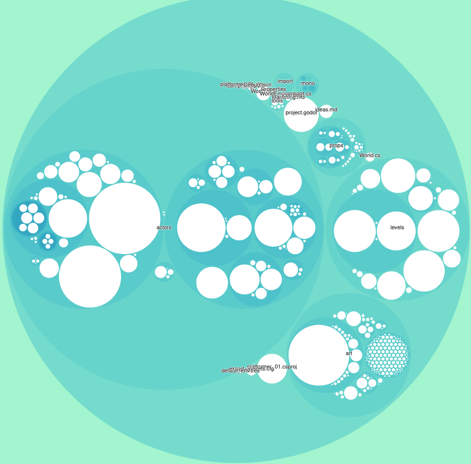

# debt-hotspots

Scan a git folder and gives a JSON output with the following data:
 * File name
 * Amount of commits
 * Amount of lines
 * Computed "score" (higher = lots of commits and lines), per file and folder

Files with a lot of lines and a lot of commits might be "technical debt hotspots". Improving these files should improve your situation.

Inspired by https://www.youtube.com/watch?v=SdUewLCHWvU (you should watch it!)


## Installation

You need node and either NPM or Yarn to run this. To install just run:
```
npm install // or yarn install
```

## Usage

May work on Windows (untested), best with Linux / Windows Linux Subsystem / GitBash. Just run:
```
node index.js /path/to/git/repo > output.json
```

## Interpretation

The output of this program is simply an indicator, a first raw analysis. You should look at large white bubbles, and investigate why these files are showing up in the report. Maybe it's large because this is an exceptionally large file (like a binary), and it's ok, you really want that file on your repository. But maybe it's large because it has an unusual number of lines, and is very frequently edited. Then, maybe some refactoring should be done.

Be careful not to simply associate "large bubble" with "bad". Just make sure the reasons this bubble is big are valid.

# Visualization

You can view the results with `view/index.html`. A demo json file is provided. To visualize your results, just update the `index.html` file to read your generated json output.
```
d3.json("demo_graph.json", function(error, root) {
```

# Demo

